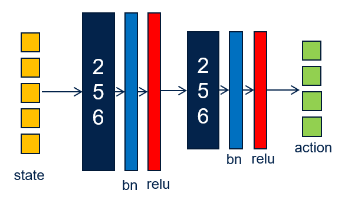
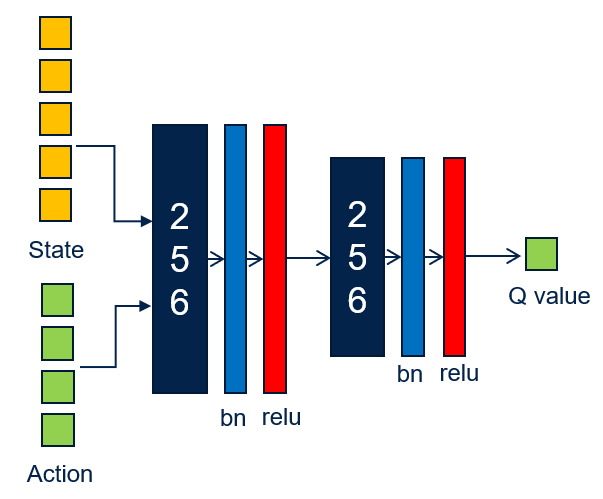
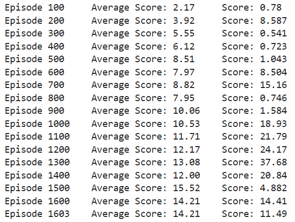
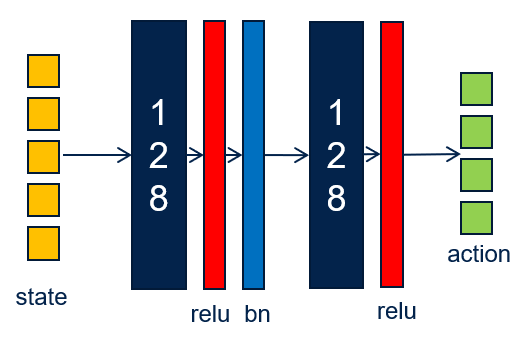
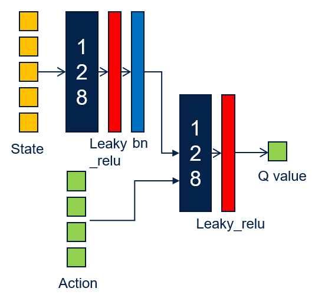
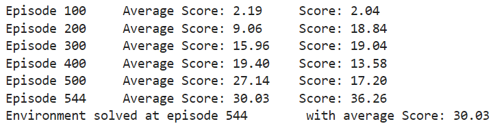
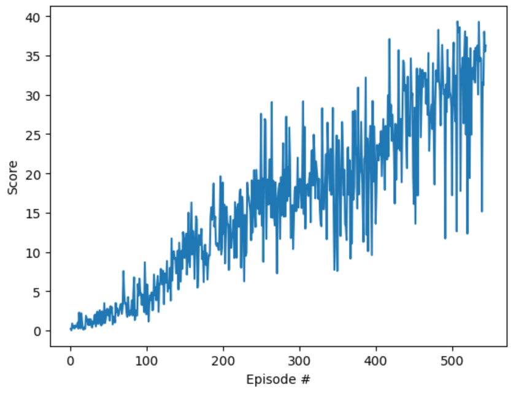

# DRL_P2_Continuous_Control

[//]: # (Image References)

[image1]: https://user-images.githubusercontent.com/10624937/43851024-320ba930-9aff-11e8-8493-ee547c6af349.gif "Trained Agent"


## 1 Introduction

The goal of this project is to train an agent to control a a double jointed arm in the [Reacher](https://github.com/Unity-Technologies/ml-agents/blob/master/docs/Learning-Environment-Examples.md#reacher) environment. A reward of +0.1 is provided for each step that the agent's hand is in the goal location. Thus, the goal of the agent is to maintain its position at the target location for as many time steps as possible.

![Trained Agent][image1]

The observation space consists of 33 variables corresponding to position, rotation, velocity, and angular velocities of the arm. Each action is a vector with four numbers, corresponding to torque applicable to two joints. Every entry in the action vector should be a number between -1 and 1.

The task is episodic, and in order to solve the environment,  the agent must get an average **score of +30** over 100 consecutive episodes.

## 2 Algorithm Implementation

### 2.1 Multi-Agent with Deep Deterministic Policy Gradient (DDPG)

In this task, **DDPG** has been selected as the basic algorithm for each agent, which is an advanced reinforcement learning algorithm that is particularly well-suited for continuous action spaces. It combines ideas from both policy gradient methods and value-based methods to learn policies that can handle high-dimensional action spaces effectively.

DDPG uses an **actor-critic** architecture, where the actor is responsible for selecting actions based on the current policy, and the critic evaluates the actions taken by the actor by estimating the action-value function (Q-value).

It employs **target networks** for both the actor and the critic. These target networks are updated slowly (using soft updates) to stabilize learning. The target networks are used to compute the target Q-values, which helps in reducing variance in the updates.

A first neural network structure has been tested at the beginning as below figures (actor and critic respectively):




However, with this structure, the training takes very long time. The average score only reaches about 15 after 1600 episode of training. Therefore, I changed the NN structure to a simpler one.



The final neural networks are implemented in the `model.py` file which can be found [here](https://github.com/yijun-deng/DRL_P2_Continuous_Control/blob/main/model.py#L5). The following figures shows the final structure of the 2 neural networks (actor and critic) respectively:




The DDPG agent has been implemented in the `ddpg_agent.ipynb` file which can be found [here](https://github.com/yijun-deng/DRL_P2_Continuous_Control/blob/main/ddpg_agent.py#L5), with the hyperparameters as below:
```python
BUFFER_SIZE = int(1e6)  # replay buffer size
BATCH_SIZE = 128        # minibatch size
GAMMA = 0.99            # discount factor
TAU = 1e-3              # for soft update of target parameters
LR_ACTOR = 1e-4         # learning rate of the actor 
LR_CRITIC = 1e-4        # learning rate of the critic
WEIGHT_DECAY = 0        # L2 weight decay
```

### 2.2 Exploration and Exploitation

The OUNoise is added to the actions to balance the trade-off between exploration (trying new actions to discover their effects) and exploitation (choosing best actions based on current knowledge).

To make the learning more efficient, a decayed epsilon has been used, which means that the value of epsilon is not fixed but rather decreases over time. This decay allows the agent to explore more in the early stages of training when it has less knowledge about the environment and gradually shift towards exploiting its learned knowledge as training progresses. The values of decayed epsilon are as below:
```python
eps_start=1.0, eps_decay=0.9999
```
Where eps_start is the initial value of epsilon, eps_decay is its decay rate.

## 3 Result

The bolow figure shows the final result of the training. With the simpler NN structure, the agent was able to learn much faster and solve the environment after **544** episodes, with an average score of **30.03**.



A plotting of the score history:



## 4 Future Improvements

Even though DDPG is good enough to solve this task, we could still try some other improvements:
- Use the 2nd version of environment which contains 20 identical agents, each with its own copy of the environment.
- Try other algorithms like PPO, A3C and D4PG which use multiple copies of the same agent to distribute the task of gathering experience.

